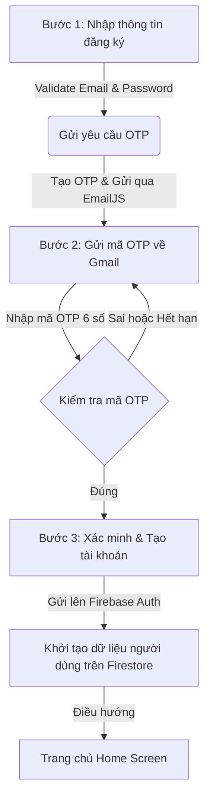

# Kế hoạch và Nội dung Báo cáo: Module Xác thực (Authentication)

Tài liệu này bao gồm hai phần chính:
1. **Hướng dẫn các điểm cần chụp ảnh màn hình (Screenshots)** để đưa vào báo cáo minh họa.
2. **Nội dung báo cáo chi tiết (Bản tiếng Việt)** có sẵn mã nguồn minh họa và mô tả luồng để bạn copy trực tiếp vào báo cáo/kế hoạch của mình.

---

## PHẦN I: HƯỚNG DẪN CÁC ĐIỂM CẦN CHỤP ẢNH MINH HỌA

Để báo cáo có độ tin cậy và chuyên nghiệp cao, bạn nên chụp các màn hình sau:

### 1. Trên Giao Diện Ứng Dụng (Client App UI)
*   **Màn hình Đăng ký tài khoản (Register Screen):**
    *   Chụp giao diện trống và giao diện khi nhập thông tin (Email, mật khẩu).
    *   *Đặc biệt:* Chụp trạng thái các ô gợi ý mật khẩu thay đổi màu sắc khi người dùng gõ (ví dụ: chuyển sang màu xanh lá khi đủ 8 ký tự, có chữ hoa, có số).
*   **Màn hình Xác thực OTP (OTP Verification Screen):**
    *   Chụp khi nhận được mã OTP và giao diện nhập 6 ô số.
    *   Chụp trạng thái đang đếm ngược thời gian gửi lại (countdown timer) hoặc nút "Gửi lại mã" khi hết thời gian chờ.
*   **Màn hình Đăng nhập (Login Screen):**
    *   Chụp màn hình đăng nhập với tùy chọn nhập Email/Password, nút Đăng nhập bằng Google và Đăng nhập bằng Apple.
*   **Màn hình Trang chủ (Home Screen - Main Screen):**
    *   Giao diện sau khi đăng nhập hoặc đăng ký thành công (chứng minh luồng điều hướng hoạt động đúng).

### 2. Trên Hộp thư Email (Gmail nhận OTP)
*   **Email chứa mã OTP thực tế:** Chụp giao diện email gửi về từ hệ thống (sử dụng template của EmailJS) chứa 6 chữ số OTP.

### 3. Trên Dashboard Quản Trị Hệ Thống (Firebase Console & EmailJS)
*   **Firebase Authentication Dashboard:**
    *   Vào [Firebase Console](https://console.firebase.google.com/) -> Build -> Authentication -> Users. Chụp danh sách các tài khoản người dùng đã được tạo thành công (bao gồm cả tài khoản Email/Password và tài khoản Google).
*   **Firestore Database Collections:**
    *   Vào Firebase Console -> Firestore Database. Chụp cấu trúc dữ liệu người dùng được khởi tạo tự động sau khi đăng ký thành công:
        *   Tài liệu (Document) của user trong collection `users` chứa thông tin `email`, `role`, `needsTutorial`.
        *   Các sub-collections như `profile` (thông tin chi tiết), `settings` (ngôn ngữ, tiền tệ mặc định), và `wallets` (ví "Tiền mặt" mặc định với số dư = 0).
*   **EmailJS Dashboard (Tùy chọn):**
    *   Chụp màn hình EmailJS Template hoặc lịch sử gửi email (Activity Log) để minh họa cơ chế gửi OTP qua SMTP/API.

---

## PHẦN II: NỘI DUNG BÁO CÁO CHI TIẾT (COPY LÀM PLAN/BÁO CÁO)

Dưới đây là nội dung văn bản chi tiết cấu trúc theo chuẩn báo cáo khoa học/báo cáo bài tập lớn:

---

### **4.2. Hiện thực các module chính**

#### **4.2.1. Module Xác thực (Authentication)**

Module Xác thực đóng vai trò then chốt trong việc bảo mật thông tin tài chính cá nhân của người dùng. Hệ thống hỗ trợ hai phương thức chính: Xác thực qua Email/Mật khẩu truyền thống kết hợp OTP 2 lớp (Two-Factor Authentication), và đăng nhập nhanh thông qua bên thứ ba (Google/Apple Sign-In). Toàn bộ dữ liệu xác thực được quản lý tập trung và an toàn bởi Firebase Authentication.

---

##### **A. Mô tả luồng 3 bước đăng ký tài khoản mới**

Quy trình đăng ký tài khoản được thiết kế tối giản nhằm nâng cao trải nghiệm người dùng nhưng vẫn đảm bảo tính xác thực qua 3 bước khép kín:



*   **Bước 1: Nhập thông tin tài khoản tại `RegisterPage`**
    *   Người dùng nhập địa chỉ Email (phải có đuôi định dạng `@gmail.com`).
    *   Nhập Mật khẩu & Xác nhận mật khẩu: Mật khẩu bắt buộc tối thiểu 8 ký tự, bao gồm ít nhất một chữ viết hoa và một chữ số. Hệ thống cung cấp các chip trạng thái trực quan để người dùng nhận diện độ mạnh yếu của mật khẩu theo thời gian thực.
    *   Nhấp chọn **"GỬI MÃ OTP"**. Giao diện ứng dụng chuyển sang trạng thái Loading nhằm ngăn chặn việc nhấn đúp.
*   **Bước 2: Hệ thống gửi mã OTP & chuyển sang `OtpScreen`**
    *   Một mã OTP gồm 6 chữ số ngẫu nhiên được sinh ra ở bộ nhớ tạm của `OtpService` trên client cùng thời gian hết hạn là 5 phút.
    *   Mã OTP này được chuyển tới API của dịch vụ **EmailJS** để gửi trực tiếp tới email đăng ký của người dùng dưới dạng email HTML được thiết kế sẵn.
    *   Hệ thống tự động chuyển hướng người dùng sang màn hình nhập OTP (`OtpScreen`). Tại đây hiển thị đồng hồ đếm ngược 60 giây. Sau 60 giây, nếu chưa nhận được email, người dùng có thể nhấn nút **"Gửi lại mã"**.
*   **Bước 3: Xác minh OTP & Tiến hành đăng ký trên Firebase**
    *   Người dùng điền mã OTP vào 6 ô nhập liệu. Hệ thống tự động kiểm tra tính hợp lệ (trùng khớp và chưa hết hạn).
    *   Nếu mã OTP chính xác, hệ thống sẽ thực hiện cuộc gọi bất đồng bộ tới Firebase Authentication thông qua phương thức `createUserWithEmailAndPassword`.
    *   Sau khi đăng ký thành công trên Firebase Auth, hệ thống tự động khởi tạo dữ liệu mặc định ban đầu cho người dùng trên Cloud Firestore (bao gồm thông tin Profile, Cài đặt ứng dụng, Ví tiền mặc định và Danh mục chi tiêu). Sau đó, người dùng được điều hướng trực tiếp về trang chủ **MainScreen**.

---

##### **B. Cơ chế Đăng nhập (Email, Google, Apple)**

*   **Đăng nhập bằng Email/Mật khẩu:** Người dùng nhập thông tin đăng nhập, hệ thống gọi dịch vụ `signInWithEmailAndPassword` của Firebase. Trạng thái đăng nhập được đồng bộ qua `AuthProvider` (sử dụng ChangeNotifier và Stream) giúp quản lý phiên làm việc một cách nhất quán.
*   **Đăng nhập bằng Google (Google Sign-In):**
    *   Sử dụng thư viện `google_sign_in`.
    *   Trên Web, gọi phương thức `signInWithPopup`. Trên thiết bị di động (Android/iOS), mở luồng chọn tài khoản Google cục bộ để lấy mã Token xác thực (`accessToken`, `idToken`), sau đó chuyển đổi thành thông tin xác thực (`GoogleAuthProvider.credential`) gửi lên Firebase Auth.
    *   Nếu là người dùng mới đăng nhập lần đầu bằng Google, Firestore sẽ tự động kích hoạt tiến trình tạo profile và ví tiền mặc định.
*   **Đăng nhập bằng Apple (Apple Sign-In):** Cung cấp sẵn giao diện nút bấm và thiết lập cấu hình tích hợp, sẵn sàng kết nối dịch vụ Apple Authentication đối với các phiên bản chạy trên nền tảng hệ điều hành iOS.

---

##### **C. Đoạn code minh họa tiêu biểu**

###### **1. Lớp dịch vụ quản lý OTP (`OtpService`)**
Tải mã OTP lên bộ nhớ tạm thời và gửi email thông qua API EmailJS.

```dart
// File: lib/core/config/otp_service.dart
class OtpService {
  static const _serviceId = 'service_7s2qo1q';
  static const _templateId = 'template_n0ka7az';
  static const _publicKey = '9hNTZZ_JrPRmoU2Ne';

  static final Map<String, _OtpEntry> _otpStore = <String, _OtpEntry>{};

  // Sinh mã OTP ngẫu nhiên 6 chữ số
  static String _generateOTP() => (100000 + Random().nextInt(900000)).toString();

  // Gửi OTP qua EmailJS + lưu tạm OTP trong bộ nhớ (hết hạn sau 5 phút)
  static Future<void> sendOTP(String email) async {
    final normalizedEmail = email.trim().toLowerCase();
    final otp = _generateOTP();

    _otpStore[normalizedEmail] = _OtpEntry(
      otp: otp,
      expiresAt: DateTime.now().add(const Duration(minutes: 5)),
    );

    // Gửi yêu cầu HTTP POST đến API EmailJS
    final response = await http.post(
      Uri.parse('https://api.emailjs.com/api/v1.0/email/send'),
      headers: {
        'Content-Type': 'application/json',
        'origin': 'http://localhost',
      },
      body: jsonEncode({
        'service_id': _serviceId,
        'template_id': _templateId,
        'user_id': _publicKey,
        'template_params': {'to_email': normalizedEmail, 'otp': otp},
      }),
    );

    if (response.statusCode != 200) {
      _otpStore.remove(normalizedEmail);
      throw Exception('Gửi OTP thất bại: ${response.body}');
    }
  }

  // Xác minh OTP do người dùng nhập vào
  static Future<void> verifyOTP(String email, String inputOTP) async {
    final normalizedEmail = email.trim().toLowerCase();
    final entry = _otpStore[normalizedEmail];

    if (entry == null) throw Exception('OTP không tồn tại');
    if (DateTime.now().isAfter(entry.expiresAt)) {
      _otpStore.remove(normalizedEmail);
      throw Exception('OTP đã hết hạn, vui lòng gửi lại');
    }
    if (entry.otp != inputOTP) {
      throw Exception('OTP không đúng');
    }
    _otpStore.remove(normalizedEmail); // Xóa mã sau khi xác thực thành công
  }
}
```

###### **2. Đăng ký tài khoản trên Firebase và Khởi tạo dữ liệu mặc định (`AuthService`)**
Sau khi xác thực OTP thành công, gọi dịch vụ Firebase Auth để đăng ký và ghi nhận cấu hình mặc định ban đầu lên Firestore.

```dart
// File: lib/core/config/auth_service.dart

// 1. Gọi Firebase Auth tạo tài khoản bằng Email và Password
Future<void> registerAfterOTP(String email, String password) async {
  final credential = await _auth.createUserWithEmailAndPassword(
    email: email,
    password: password,
  );

  final uid = credential.user!.uid;
  
  // 2. Khởi tạo cấu hình và dữ liệu ban đầu cho người dùng trên Firestore
  await _initializeUserData(
    uid: uid,
    email: email,
    displayName: email.split('@')[0],
    photoURL: '',
    markNeedsTutorial: true,
  );
}

// Khởi tạo các tài liệu Firestore liên quan (Settings, Wallet mặc định, Categories mặc định)
Future<void> _initializeUserData({
  required String uid,
  required String email,
  required String displayName,
  required String photoURL,
  required bool markNeedsTutorial,
}) async {
  // Ghi nhận thông tin User Profile
  await _firestore.collection('users').doc(uid).set({
    'email': email,
    'displayName': displayName,
    'photoURL': photoURL,
    'emailVerified': true,
    'createdAt': FieldValue.serverTimestamp(),
    'uid': uid,
    'role': 'user',
    'needsTutorial': markNeedsTutorial,
  }, SetOptions(merge: true));

  // Ghi nhận Cài đặt ứng dụng mặc định (ngôn ngữ tiếng Việt, tiền tệ VND)
  await _firestore.collection('users').doc(uid).collection('settings').doc('app_settings').set({
    'userId': uid,
    'language': 'vi',
    'currency': 'VND',
    'theme': 'system',
    'notificationsEnabled': true,
    'budgetAlertPercent': 80,
    'updatedAt': FieldValue.serverTimestamp(),
  }, SetOptions(merge: true));

  // Tạo ví mặc định "Tiền mặt" với số dư 0 VND
  final cashWallet = WalletModel(
    id: 'wallet_cash_$uid',
    userId: uid,
    name: 'Tiền mặt',
    balance: 0,
    type: 'cash',
    color: Colors.green.value,
    icon: 'cash',
    isDefault: true,
    createdAt: DateTime.now(),
    updatedAt: DateTime.now(),
  );
  await _firestore.collection('users').doc(uid).collection('wallets').doc(cashWallet.id).set(cashWallet.toMap());

  // Đăng ký các danh mục thu chi mặc định (dùng batch để tối ưu hóa hiệu năng ghi)
  final defaultCategories = CategoryData.getAllCategories();
  final batch = _firestore.batch();
  for (final cat in defaultCategories) {
    final docRef = _firestore.collection('users').doc(uid).collection('categories').doc(cat.id);
    batch.set(docRef, cat.copyWith(userId: uid).toMap());
  }
  await batch.commit();
}
```

###### **3. Quản lý Đăng nhập Google & Lưu trữ phiên làm việc**
Xử lý đăng nhập thông qua tài khoản Google ở tầng Service.

```dart
// File: lib/core/config/auth_service.dart
Future<String?> signInWithGoogle() async {
  try {
    UserCredential result;
    if (kIsWeb) {
      result = await _auth.signInWithPopup(GoogleAuthProvider());
    } else {
      final googleUser = await _googleSignIn.signIn();
      if (googleUser == null) return 'Đã hủy đăng nhập Google.';

      final googleAuth = await googleUser.authentication;
      final credential = GoogleAuthProvider.credential(
        accessToken: googleAuth.accessToken,
        idToken: googleAuth.idToken,
      );
      result = await _auth.signInWithCredential(credential);
    }

    final user = result.user;
    if (user == null) return 'Không thể xác thực tài khoản Google.';

    // Kiểm tra và khởi tạo dữ liệu nếu là người dùng đăng nhập lần đầu
    final userDoc = await _firestore.collection('users').doc(user.uid).get();
    final isNewUser = result.additionalUserInfo?.isNewUser == true;
    if (isNewUser || !userDoc.exists) {
      await _initializeUserData(
        uid: user.uid,
        email: user.email ?? '',
        displayName: user.displayName ?? '',
        photoURL: user.photoURL ?? '',
        markNeedsTutorial: isNewUser,
      );
    }
    return null; // Trả về null khi đăng nhập thành công không có lỗi
  } on FirebaseAuthException catch (e) {
    return e.message ?? 'Không thể đăng nhập bằng Google.';
  } catch (e) {
    return e.toString();
  }
}
```

###### **4. Điều hướng ứng dụng khi trạng thái thay đổi**
Ứng dụng sử dụng Stream `authStateChanges` được lắng nghe ở `AuthProvider` để tự động điều hướng người dùng. Khi phiên đăng nhập thay đổi (đăng nhập hoặc đăng xuất thành công), luồng dữ liệu tự động cập nhật trạng thái giao diện giúp loại bỏ việc lưu trữ token thủ công và đảm bảo tính đồng bộ cao.

```dart
// Trích xuất từ lib/ui/providers/auth_provider.dart
class AuthProvider extends ChangeNotifier {
  AuthProvider({AuthService? authService})
    : _authService = authService ?? AuthService.instance {
    // Lắng nghe thay đổi trạng thái xác thực của Firebase
    _subscription = _authService.authStateChanges().listen(_handleAuthStateChanged);
  }

  final AuthService _authService;
  StreamSubscription<User?>? _subscription;
  User? _currentUser;
  bool _isLoading = true;

  User? get currentUser => _currentUser;
  bool get isAuthenticated => _currentUser != null;

  Future<void> _handleAuthStateChanged(User? user) async {
    _currentUser = user;
    if (user == null) {
      _isLoading = false;
      notifyListeners();
      return;
    }
    _isLoading = false;
    notifyListeners();
  }
}
```
