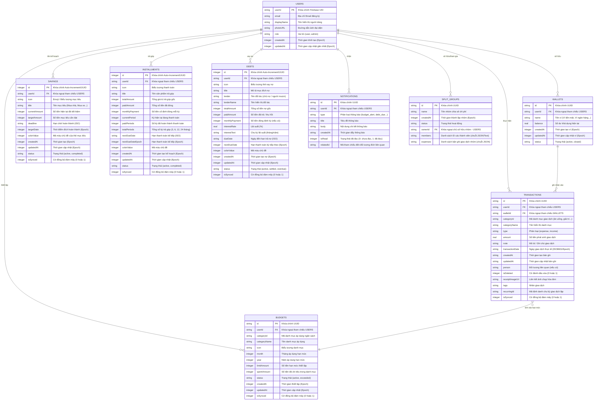

# Kế hoạch và Nội dung Báo cáo: Thiết kế Cơ sở Dữ liệu & Sơ đồ ERD

Tài liệu này bao gồm hai phần chính:
1. **Hướng dẫn các điểm cần chụp ảnh màn hình (Screenshots)** để đưa vào báo cáo minh họa.
2. **Nội dung báo cáo chi tiết (Bản tiếng Việt)** có sẵn sơ đồ thực thể liên kết (ERD) bằng cú pháp Mermaid và đặc tả chi tiết các bảng cơ sở dữ liệu để bạn copy trực tiếp vào báo cáo/kế hoạch của mình.

---

## PHẦN I: HƯỚNG DẪN CÁC ĐIỂM CẦN CHỤP ẢNH MINH HỌA

Để minh họa trực quan cho phần thiết kế cơ sở dữ liệu trong báo cáo, bạn nên chuẩn bị các hình ảnh sau:

### 1. Trên Database Browser (Minh họa SQLite cục bộ)
*   **Cấu trúc các bảng (Database Schema):** Sử dụng các công cụ như *DB Browser for SQLite* để mở file cơ sở dữ liệu `expense_manager.db` kết xuất từ máy ảo/thiết bị test. Chụp danh sách các bảng kèm kiểu dữ liệu của chúng (`transactions`, `budgets`, `savings`, `installments`, `debts`, `wallets`, `auth_session`, `notifications`, `split_groups`).
*   **Bảng dữ liệu thực tế (Table Data):** Chụp màn hình dữ liệu thực tế đang được lưu trong bảng `transactions` hoặc `wallets` cục bộ trên thiết bị của bạn.

### 2. Trên Cloud Firestore Console (Minh họa Firebase Backend)
*   **Cấu trúc Collections:** Truy cập Firebase Console -> Firestore Database. Chụp cấu trúc phân cấp các collection của người dùng:
    *   Cấp cao nhất: Document trong collection `users` (chứa các trường profile cơ bản như `email`, `displayName`, `photoURL`, `role`, `needsTutorial`).
    *   Các sub-collections tương ứng của từng người dùng: `wallets`, `transactions`, `budgets`, `savings`, `installments`, `debts`, `notifications`, `split_groups` tương tự cấu trúc lưu dưới local sqlite.

---

## PHẦN II: NỘI DUNG BÁO CÁO CHI TIẾT (COPY LÀM PLAN/BÁO CÁO)

---

### **3.3. Thiết kế cơ sở dữ liệu**

Ứng dụng quản lý chi tiêu cá nhân cá nhân hóa AI tích hợp cấu trúc dữ liệu lai **(Hybrid Database Architecture)** kết hợp cơ sở dữ liệu quan hệ cục bộ **SQLite** trên thiết bị di động (đảm bảo tính năng sử dụng ngoại tuyến mượt mà) và cơ sở dữ liệu NoSQL **Cloud Firestore** trên đám mây (đảm bảo tính đồng bộ dữ liệu thời gian thực và khôi phục dữ liệu khi thay đổi thiết bị). 

Dữ liệu cục bộ được lưu dưới dạng tập tin quan hệ `expense_manager.db` thông qua thư viện `sqflite`, trong khi dữ liệu đám mây được tổ chức dưới dạng các Collection và Document linh hoạt thông qua thư viện `cloud_firestore`.

#### **3.3.1. Sơ đồ thực thể liên kết (ERD)**

Dưới đây là sơ đồ thực thể liên kết (ERD) mô tả mối quan hệ giữa các thực thể cốt lõi trong hệ thống quản lý tài chính cá nhân. Sơ đồ biểu diễn quan hệ logic làm nền tảng cho việc khởi tạo các bảng SQLite cục bộ cũng như ánh xạ các sub-collections trên Cloud Firestore.

##### **B. Giải thích mối quan hệ chính giữa các thực thể**
1.  **USERS với các thực thể khác (Quan hệ 1 - Nhiều):** Mỗi người dùng sở hữu duy nhất một tài khoản thông tin cá nhân (`USERS`). Người dùng có quyền sở hữu nhiều tài khoản Ví tiền (`WALLETS`), thực hiện nhiều Giao dịch (`TRANSACTIONS`), cài đặt nhiều Ngân sách hạn mức (`BUDGETS`), thiết lập nhiều Mục tiêu tiết kiệm (`SAVINGS`), Kế hoạch trả góp (`INSTALLMENTS`), các khoản Vay nợ (`DEBTS`), và nhận các Thông báo hệ thống (`NOTIFICATIONS`).
2.  **WALLETS với TRANSACTIONS (Quan hệ 1 - Nhiều):** Mỗi một giao dịch (thu hoặc chi) bắt buộc phải gắn liền với một ví tiền cụ thể để cộng/trừ số dư phù hợp. Một ví tiền có thể chứa lịch sử của nhiều giao dịch khác nhau.
3.  **TRANSACTIONS với BUDGETS (Mối liên kết gián tiếp qua `categoryId`):** Mỗi khi có một giao dịch chi tiêu (`type = expense`) thuộc một danh mục được tạo ra, hệ thống sẽ tự động quét qua bảng `BUDGETS` xem có ngân sách nào đang đặt cho danh mục đó trong tháng hiện tại hay không. Nếu có, số tiền chi tiêu sẽ được cộng dồn vào `spentAmount` của ngân sách đó để kiểm tra cảnh báo vượt hạn mức chi tiêu.
4.  **SPLIT_GROUPS với USERS:** Một nhóm chia sẻ chi phí hóa đơn sở hữu bởi một trưởng nhóm (`ownerId` liên kết đến `userId`). Các thành viên trong nhóm và các chi phí phát sinh được lưu trữ trực tiếp dưới dạng cấu trúc JSON nén vào cột `members` và `expenses` để tối ưu hóa truy vấn ngoại tuyến trên SQLite.

---

### **3.3.2. Mô tả chi tiết cấu trúc các bảng cơ sở dữ liệu (SQLite Schema)**

Để tương thích chặt chẽ với cơ chế đồng bộ hóa bất đồng bộ, các thuộc tính của bảng dưới SQLite được thiết kế song song cả dạng viết hoa lạc đà (camelCase) dùng cho các Model trong Dart và dạng viết thường có dấu gạch dưới (snake_case) dùng cho tương thích cấu trúc cơ sở dữ liệu truyền thống.

#### **1. Bảng `auth_session` (Thông tin phiên đăng nhập người dùng)**
Bảng này lưu trữ thông tin cơ bản về người dùng hiện tại đang đăng nhập trên thiết bị.

| Tên trường (SQLite) | Kiểu dữ liệu | Ràng buộc | Mô tả |
| :--- | :--- | :--- | :--- |
| `userId` / `user_id` | TEXT | PRIMARY KEY | ID định danh duy nhất của người dùng trên Firebase Auth. |
| `email` | TEXT | NOT NULL | Địa chỉ email đăng ký tài khoản. |
| `displayName` | TEXT | NULLABLE | Tên hiển thị người dùng nhập vào hoặc lấy từ tài khoản Google. |
| `photoURL` / `photo_url` | TEXT | NULLABLE | URL dẫn tới ảnh đại diện của người dùng lưu trữ trực tuyến. |
| `role` | TEXT | DEFAULT 'user' | Vai trò phân quyền người dùng trong ứng dụng. |
| `createdAt` / `created_at`| INTEGER | NOT NULL | Thời gian tạo tài khoản (dưới dạng giây tính từ mốc Epoch). |
| `updatedAt` / `updated_at`| INTEGER | NOT NULL | Thời gian cập nhật thông tin tài khoản gần nhất. |

#### **2. Bảng `wallets` (Danh sách tài khoản ví tiền người dùng)**
Lưu trữ thông tin các nguồn tiền mặt, tài khoản ngân hàng hoặc ví điện tử.

| Tên trường (SQLite) | Kiểu dữ liệu | Ràng buộc | Mô tả |
| :--- | :--- | :--- | :--- |
| `id` | TEXT | PRIMARY KEY | Mã định danh duy nhất của ví (UUID). |
| `userId` / `user_id` | TEXT | FK (USERS) | Liên kết người dùng sở hữu ví này. |
| `name` | TEXT | NOT NULL | Tên gọi của ví (ví dụ: Tiền mặt, Techcombank, Momo...). |
| `balance` | REAL | DEFAULT 0.0 | Số dư khả dụng hiện tại của ví. |
| `createdAt` / `created_at`| INTEGER | NOT NULL | Thời gian khởi tạo ví. |
| `updatedAt` / `updated_at`| INTEGER | NOT NULL | Thời gian cập nhật số dư/thông tin ví gần nhất. |
| `status` | TEXT | DEFAULT 'active' | Trạng thái ví (`active` đang sử dụng, `closed` đã ẩn đi). |

#### **3. Bảng `transactions` (Lịch sử giao dịch thu chi)**
Bảng quan trọng nhất chứa thông tin chi tiết từng khoản thu nhập hoặc chi tiêu của người dùng.

| Tên trường (SQLite) | Kiểu dữ liệu | Ràng buộc | Mô tả |
| :--- | :--- | :--- | :--- |
| `id` | TEXT | PRIMARY KEY | Mã định danh duy nhất của giao dịch (UUID). |
| `userId` / `user_id` | TEXT | FK (USERS) | Người tạo ra giao dịch này. |
| `walletId` / `wallet_id` | TEXT | FK (WALLETS) | Ví chịu tác động cộng hoặc trừ tiền của giao dịch. |
| `categoryId` / `category_id`| TEXT | NOT NULL | Mã định danh danh mục (ví dụ: `food`, `entertainment`...). |
| `categoryName`/`category_name`| TEXT | NOT NULL | Tên danh mục hiển thị trực quan (Ăn uống, Giải trí...). |
| `type` | TEXT | NOT NULL | Phân loại giao dịch: `expense` (Chi tiêu) hoặc `income` (Thu nhập). |
| `amount` | REAL | NOT NULL | Số tiền phát sinh của giao dịch. |
| `note` | TEXT | NULLABLE | Mô tả chi tiết hoặc ghi chú riêng của người dùng. |
| `transactionDate` / `date` | TEXT | NOT NULL | Ngày người dùng thực hiện giao dịch (Lưu chuỗi ISO8601). |
| `createdAt` / `created_at`| TEXT | NOT NULL | Thời gian bản ghi giao dịch được chèn vào SQLite. |
| `updatedAt` / `updated_at`| TEXT | NOT NULL | Thời gian cập nhật chỉnh sửa bản ghi gần nhất. |
| `person` | TEXT | NULLABLE | Đối tượng đi kèm có liên quan đến giao dịch này. |
| `isDeleted` | INTEGER | DEFAULT 0 | Cờ đánh dấu xóa mềm phục vụ đồng bộ dữ liệu (1: đã xóa, 0: bình thường). |
| `receiptImageUrl` | TEXT | NULLABLE | Đường dẫn liên kết đến ảnh hóa đơn đã tải lên Cloud Storage. |
| `tags` | TEXT | NULLABLE | Các thẻ nhãn nhóm giao dịch (Ngăn cách bằng dấu phẩy). |
| `recurringId` | TEXT | NULLABLE | Mã liên kết giao dịch lặp định kỳ (nếu có). |
| `isSynced` | INTEGER | DEFAULT 0 | Trạng thái đồng bộ đám mây (1: đã đồng bộ, 0: chưa đồng bộ). |

#### **4. Bảng `budgets` (Ngân sách chi tiêu hàng tháng)**
Quản lý hạn mức chi tiêu được đặt ra cho từng danh mục trong một tháng cụ thể.

| Tên trường (SQLite) | Kiểu dữ liệu | Ràng buộc | Mô tả |
| :--- | :--- | :--- | :--- |
| `id` | TEXT | PRIMARY KEY | Mã định danh duy nhất của ngân sách. |
| `userId` / `user_id` | TEXT | FK (USERS) | Người thiết lập ngân sách. |
| `categoryId` / `category_id`| TEXT | NOT NULL | Danh mục áp hạn mức chi tiêu. |
| `categoryName`/`category_name`| TEXT | NOT NULL | Tên danh mục hiển thị. |
| `icon` | TEXT | NULLABLE | Biểu tượng nhận diện danh mục. |
| `month` | INTEGER | NOT NULL | Tháng áp dụng ngân sách (1 - 12). |
| `year` | INTEGER | NOT NULL | Năm áp dụng ngân sách (ví dụ: 2026). |
| `limitAmount`/`limit_amount`| INTEGER | NOT NULL | Số tiền hạn mức tối đa cho phép chi tiêu. |
| `spentAmount`/`spent_amount`| INTEGER | DEFAULT 0 | Tổng số tiền đã chi tiêu thực tế trong tháng đó. |
| `status` | TEXT | DEFAULT 'active' | Trạng thái hoạt động (`active` hoặc `exceeded` quá hạn mức). |
| `createdAt` / `created_at`| INTEGER | NOT NULL | Thời điểm thiết lập ngân sách. |
| `updatedAt` / `updated_at`| INTEGER | NOT NULL | Thời điểm cập nhật ngân sách. |
| `isSynced` | INTEGER | DEFAULT 0 | Trạng thái đồng bộ đám mây (1: đã đồng bộ, 0: chưa đồng bộ). |

#### **5. Bảng `savings` (Quản lý các mục tiêu tiết kiệm)**

| Tên trường (SQLite) | Kiểu dữ liệu | Ràng buộc | Mô tả |
| :--- | :--- | :--- | :--- |
| `id` | INTEGER | PRIMARY KEY AUTOINCREMENT | Khóa chính tự động tăng trong SQLite. |
| `userId` / `user_id` | TEXT | FK (USERS) | Người tạo mục tiêu tiết kiệm. |
| `icon` | TEXT | NULLABLE | Icon emoji đại diện cho mục tiêu. |
| `title` | TEXT | NOT NULL | Tên mục tiêu tiết kiệm. |
| `currentAmount`/`current_amount`| INTEGER | DEFAULT 0 | Số tiền hiện tại đã tích lũy được. |
| `targetAmount`/`target_amount`| INTEGER | NOT NULL | Tổng số tiền mong muốn đạt được. |
| `deadline` | TEXT | NULLABLE | Ngày hạn cuối phải hoàn thành (Dạng chuỗi ISO8601). |
| `targetDate` / `target_date`| INTEGER | NULLABLE | Hạn cuối hoàn thành lưu dạng Epoch giây. |
| `colorValue`/`color_value` | INTEGER | NOT NULL | Giá trị nguyên biểu diễn màu sắc thiết kế thẻ. |
| `createdAt` / `created_at`| INTEGER | NOT NULL | Thời gian tạo mục tiêu. |
| `updatedAt` / `updated_at`| INTEGER | NOT NULL | Thời gian cập nhật gần nhất. |
| `status` | TEXT | DEFAULT 'active' | Trạng thái mục tiêu (`active`: đang tiết kiệm, `completed`: đã đạt mục tiêu). |
| `isSynced` | INTEGER | DEFAULT 0 | Trạng thái đồng bộ đám mây (1: đã đồng bộ, 0: chưa đồng bộ). |

#### **6. Bảng `installments` (Quản lý kế hoạch mua sắm trả góp)**

| Tên trường (SQLite) | Kiểu dữ liệu | Ràng buộc | Mô tả |
| :--- | :--- | :--- | :--- |
| `id` | INTEGER | PRIMARY KEY AUTOINCREMENT | Khóa chính tự động tăng. |
| `userId` / `user_id` | TEXT | FK (USERS) | Người sở hữu hợp đồng trả góp. |
| `icon` | TEXT | NULLABLE | Biểu tượng hiển thị. |
| `title` | TEXT | NOT NULL | Tên sản phẩm mua trả góp (ví dụ: Điện thoại iPhone, Xe máy...). |
| `totalAmount`/`total_amount`| INTEGER | NOT NULL | Tổng số tiền gốc và lãi cần phải trả góp. |
| `paidAmount`/`paid_amount`| INTEGER | DEFAULT 0 | Tổng số tiền đã đóng lũy kế tính đến kỳ hiện tại. |
| `monthlyPayment`/`monthly_payment`| INTEGER | NOT NULL | Số tiền phải đóng cố định định kỳ hàng tháng. |
| `currentPeriod`/`current_period`| INTEGER | DEFAULT 1 | Số thứ tự kỳ thanh toán hiện hành. |
| `paidPeriods`/`paid_periods`| INTEGER | DEFAULT 0 | Số kỳ đã thực hiện đóng tiền thành công. |
| `totalPeriods`/`total_periods`| INTEGER | NOT NULL | Tổng số kỳ trả góp đăng ký (ví dụ: 6, 12, 24 tháng). |
| `nextDueDate`/`next_due_date`| TEXT | NOT NULL | Ngày hạn chót đóng tiền kỳ kế tiếp (Chuỗi ISO8601). |
| `nextDueDateEpoch` | INTEGER | NOT NULL | Ngày hạn chót đóng kỳ kế tiếp dạng Epoch giây. |
| `colorValue`/`color_value` | INTEGER | NOT NULL | Màu sắc đại diện giao diện thẻ. |
| `createdAt` / `created_at`| INTEGER | NOT NULL | Ngày bắt đầu khởi tạo hợp đồng trả góp. |
| `updatedAt` / `updated_at`| INTEGER | NOT NULL | Ngày cập nhật tiến trình trả góp gần nhất. |
| `status` | TEXT | DEFAULT 'active' | Trạng thái kế hoạch (`active`: đang đóng, `completed`: đã trả xong). |
| `isSynced` | INTEGER | DEFAULT 0 | Trạng thái đồng bộ đám mây (1: đã đồng bộ, 0: chưa đồng bộ). |

#### **7. Bảng `debts` (Chi tiết các khoản vay nợ và cho vay)**

| Tên trường (SQLite) | Kiểu dữ liệu | Ràng buộc | Mô tả |
| :--- | :--- | :--- | :--- |
| `id` | INTEGER | PRIMARY KEY AUTOINCREMENT | Khóa chính tự động tăng. |
| `userId` / `user_id` | TEXT | FK (USERS) | Người sở hữu bản ghi vay nợ. |
| `icon` | TEXT | NULLABLE | Biểu tượng thẻ vay nợ. |
| `title` | TEXT | NOT NULL | Mục đích vay nợ hoặc tên khoản nợ. |
| `lender` / `lenderName` | TEXT | NOT NULL | Tên của người vay hoặc người cho vay. |
| `totalAmount`/`total_amount`| INTEGER | NOT NULL | Tổng giá trị khoản nợ gốc. |
| `paidAmount`/`paid_amount`| INTEGER | DEFAULT 0 | Số tiền đã trả nợ hoặc đã thu hồi nợ tích lũy. |
| `monthlyPayment`/`monthly_payment`| INTEGER | DEFAULT 0 | Số tiền cần thanh toán từng kỳ (nếu có lãi định kỳ). |
| `interestRate`/`interest_rate`| REAL | DEFAULT 0.0 | Lãi suất kèm theo khoản vay (%). |
| `interestText`/`interest_text`| TEXT | NULLABLE | Chú thích chu kỳ tính lãi (ví dụ: 1%/tháng, 8%/năm...). |
| `dueDate` / `due_date` | TEXT | NOT NULL | Thời hạn cuối cùng phải thanh toán dứt điểm khoản nợ. |
| `nextDueDate` | INTEGER | NOT NULL | Thời điểm thanh toán tiếp theo dạng Epoch giây. |
| `colorValue`/`color_value` | INTEGER | NOT NULL | Tông màu chủ đề thẻ vay nợ. |
| `createdAt` / `created_at`| INTEGER | NOT NULL | Thời gian tạo lập khoản nợ. |
| `updatedAt` / `updated_at`| INTEGER | NOT NULL | Thời gian cập nhật trạng thái nợ gần nhất. |
| `status` | TEXT | DEFAULT 'active' | Trạng thái (`active`: chưa thanh toán xong, `settled`: đã trả hết nợ). |
| `isSynced` | INTEGER | DEFAULT 0 | Trạng thái đồng bộ đám mây (1: đã đồng bộ, 0: chưa đồng bộ). |

#### **8. Bảng `notifications` (Danh sách thông báo đẩy cục bộ)**

| Tên trường (SQLite) | Kiểu dữ liệu | Ràng buộc | Mô tả |
| :--- | :--- | :--- | :--- |
| `id` | TEXT | PRIMARY KEY | Mã định danh duy nhất của thông báo (UUID). |
| `userId` | TEXT | FK (USERS) | ID người dùng nhận thông báo. |
| `type` | TEXT | NOT NULL | Loại thông báo (`budget_alert`: vượt hạn mức, `debt_due`: đến hạn nợ). |
| `title` | TEXT | NOT NULL | Tiêu đề thông báo hiển thị trên khay hệ thống. |
| `body` | TEXT | NOT NULL | Chi tiết thông điệp nhắc nhở chi tiêu / tài chính. |
| `createdAt` | TEXT | NOT NULL | Thời điểm thông báo được sinh ra. |
| `isRead` | INTEGER | DEFAULT 0 | Trạng thái thông báo đã được xem chưa (1: đã đọc, 0: chưa đọc). |
| `relatedId` | TEXT | NULLABLE | Mã liên kết trực tiếp tới tài liệu gây ra thông báo (Mã nợ, mã ví...). |

#### **9. Bảng `split_groups` (Chia sẻ nhóm thanh toán hóa đơn chung)**

| Tên trường (SQLite) | Kiểu dữ liệu | Ràng buộc | Mô tả |
| :--- | :--- | :--- | :--- |
| `id` | TEXT | PRIMARY KEY | Mã định danh duy nhất của nhóm (UUID). |
| `name` | TEXT | NOT NULL | Tên gọi nhóm (ví dụ: Nhóm bạn thân du lịch, Nhóm phòng trọ...). |
| `createdAt` | INTEGER | NOT NULL | Thời gian thành lập nhóm. |
| `status` | TEXT | DEFAULT 'active' | Trạng thái hoạt động của nhóm chia hóa đơn. |
| `ownerId` | TEXT | FK (USERS) | Người dùng đóng vai trò trưởng nhóm / quản trị viên. |
| `members` | TEXT | NOT NULL | Chuỗi văn bản định dạng JSON lưu trữ danh sách mã thành viên. |
| `expenses` | TEXT | NOT NULL | Chuỗi JSON chứa thông tin chi tiết các khoản chi tiêu nhóm được chia đều. |
