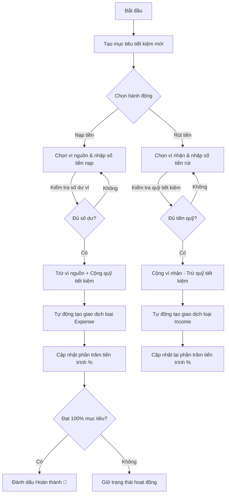
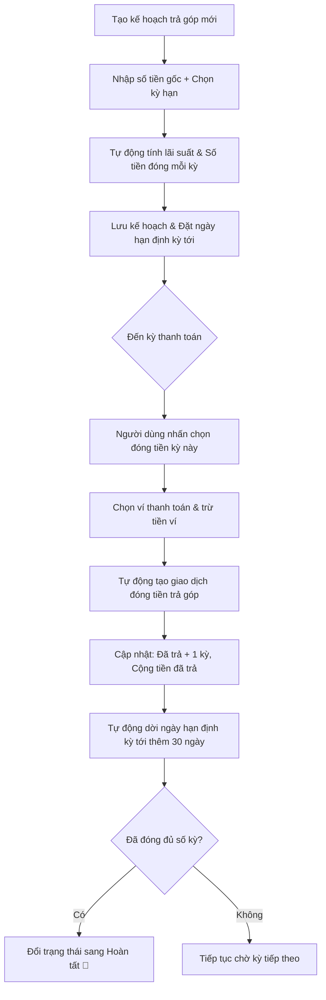
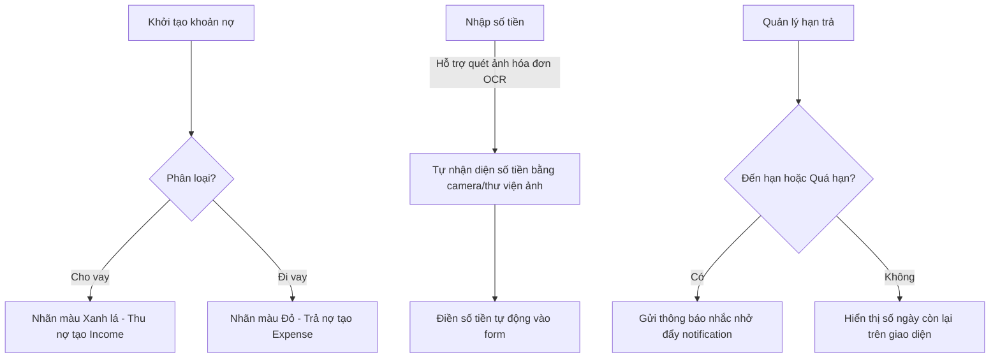

# Kế hoạch và Nội dung Báo cáo: Module Tài chính (Financial Overview)

Tài liệu này bao gồm hai phần chính:
1. **Hướng dẫn các điểm cần chụp ảnh màn hình (Screenshots)** để đưa vào báo cáo minh họa.
2. **Nội dung báo cáo chi tiết (Bản tiếng Việt)** có sẵn mã nguồn minh họa thực tế từ ứng dụng và mô tả luồng để bạn copy trực tiếp vào báo cáo/kế hoạch của mình.

---

## PHẦN I: HƯỚNG DẪN CÁC ĐIỂM CẦN CHỤP ẢNH MINH HỌA

Để báo cáo trực quan và có tính thuyết phục cao, bạn nên chụp các màn hình sau trong ứng dụng:

### 1. Trên Giao Diện Ứng Dụng (Client App UI)
*   **Màn hình chính Tài Chính (Finance Screen):**
    *   Chụp Header màu xanh chứa 3 thẻ thống kê nhanh: "Đang tiết kiệm", "Còn trả góp", "Còn vay" hiển thị tổng quan số lượng các mục tài chính đang hoạt động.
    *   Chụp Tabbar 3 tab con: "Tiết kiệm", "Trả góp", "Vay nợ".
*   **Tab Tiết kiệm (Saving Tab):**
    *   Chụp danh sách các mục tiêu tiết kiệm dưới dạng Card (ví dụ: Mua laptop, Quỹ du lịch...) với thanh tiến trình tiến độ (%) và số tiền "Hiện tại" / "Mục tiêu".
    *   Chụp hộp thoại **"Nạp tiền tiết kiệm"** và **"Rút tiền tiết kiệm"** (cho phép chọn nguồn ví và nhập số tiền có kiểm tra logic số dư).
    *   Chụp Bottom Sheet **"Thêm mục tiêu tiết kiệm"** (nhập tên mục tiêu, số tiền, ngày hạn định, chọn icon emoji và màu sắc chủ đề).
*   **Tab Trả góp (Installment Tab):**
    *   Chụp danh sách các khoản trả góp hiển thị tiến độ thanh toán (ví dụ: Đã trả 3/12 tháng), ngày thanh toán tiếp theo.
    *   Chụp hộp thoại **"Thanh toán trả góp kỳ này"** hiển thị số tiền cần trả và danh sách ví để chọn thanh toán.
    *   Chụp Bottom Sheet **"Kế hoạch trả góp mới"** (nhập tên, tổng số tiền gốc, chọn ngân hàng, chọn kỳ hạn 3/6/12/24 tháng tự động tính toán số tiền đóng hàng tháng dựa theo lãi suất định sẵn).
*   **Tab Vay nợ (Debt Tab):**
    *   Chụp bộ lọc 3 trạng thái: "Tất cả", "Chưa xong" (Active), "Đã xong" (Settled).
    *   Chụp danh sách nợ phân rõ nhãn "Cho vay" (màu xanh lá) và "Đi vay" (màu đỏ) kèm chỉ báo số ngày còn lại / quá hạn.
    *   Chụp tính năng quét hóa đơn ghi nhận số tiền thông qua OCR khi thêm/sửa khoản nợ.
    *   Chụp Bottom Sheet **"Thêm khoản vay nợ mới"** (nhập tên người vay/cho vay, loại vay, tổng số tiền, lãi suất, hạn trả).

### 2. Trên Dashboard Quản Trị Hệ Thống (Firebase Console & Firestore)
*   **Firestore Database Collections:**
    *   Vào Firebase Console -> Firestore Database. Chụp cấu trúc dữ liệu tài chính của user trong collection `users` -> `[userId]`:
        *   Collection `savings`: Chứa các tài liệu mục tiêu tiết kiệm (`currentAmount`, `targetAmount`, `targetDate`, `status`...).
        *   Collection `installments`: Chứa các tài liệu kế hoạch trả góp (`totalAmount`, `paidAmount`, `monthlyPayment`, `paidPeriods`, `totalPeriods`...).
        *   Collection `debts`: Chứa các tài liệu khoản vay nợ (`totalAmount`, `paidAmount`, `lenderName`, `interestRate`, `nextDueDate`...).

---

## PHẦN II: NỘI DUNG BÁO CÁO CHI TIẾT (COPY LÀM PLAN/BÁO CÁO)

Dưới đây là nội dung chi tiết được cấu trúc theo chuẩn báo cáo khoa học/bài tập lớn:

---

### **4.2. Hiện thực các module chính (tiếp theo)**

#### **4.2.4. Module Tài chính (Financial Overview)**

Module Tài chính (Financial Overview) hỗ trợ người dùng theo dõi và quản lý tập trung các mục tiêu tài chính dài hạn cũng như các nghĩa vụ nợ, bao gồm ba phân hệ chính: Tiết kiệm, Trả góp và Vay nợ. Module này được tích hợp trực tiếp với hệ thống Ví tiền và Giao dịch để đảm bảo tính nhất quán của dòng tiền: mỗi khi phát sinh giao dịch nạp/rút tiết kiệm, đóng trả góp hay thanh toán nợ, hệ thống sẽ tự động trừ hoặc cộng số dư tương ứng trên ví được chỉ định, đồng thời ghi nhận vào lịch sử giao dịch chung.

---

##### **A. Mô tả chi tiết & Luồng hoạt động của 3 phân hệ con**

###### **1. Phân hệ Tiết kiệm (Savings)**
Phân hệ này cho phép người dùng đặt ra các mục tiêu tiết kiệm cụ thể (như mua sắm thiết bị, đi du lịch) với số tiền mục tiêu và thời hạn hoàn thành rõ ràng.



*   **Quy trình nạp tiền (Deposit):**
    1. Người dùng chọn mục tiêu tiết kiệm và nhấn nút **"Nạp tiền"**.
    2. Ứng dụng hiển thị danh sách các ví tiền đang có cùng số dư hiện tại để người dùng lựa chọn ví nguồn.
    3. Hệ thống kiểm tra số tiền nhập vào: Số tiền phải lớn hơn 0 và không vượt quá số dư ví nguồn.
    4. Khi xác nhận, hệ thống thực hiện hai tác vụ đồng thời:
        *   Tạo một giao dịch chi tiêu (`expense`) với danh mục mặc định là `saving_dep` ("Gửi tiết kiệm"), ghi nhận note chi tiết. Giao dịch này sẽ tự động trừ số dư ví nguồn thông qua logic của `FinanceRepository`.
        *   Cập nhật tăng số tiền hiện tại (`currentAmount`) của mục tiêu tiết kiệm trên Firestore và SQLite. Nếu tổng số tiền tích lũy đạt hoặc vượt mức mục tiêu (`targetAmount`), trạng thái sẽ tự động cập nhật từ `active` sang `completed`.
*   **Quy trình rút tiền (Withdraw):**
    1. Người dùng nhấn nút **"Rút tiền"** từ mục tiêu tiết kiệm đang có.
    2. Người dùng chọn ví đích nhận tiền và nhập số tiền muốn rút.
    3. Hệ thống kiểm tra số tiền rút không được vượt quá số tiền hiện đang tích lũy trong mục tiêu tiết kiệm.
    4. Sau khi xác nhận, hệ thống tiến hành:
        *   Tạo giao dịch thu nhập (`income`) với danh mục là `saving_wd` ("Rút tiết kiệm"). Giao dịch này tự động cộng thêm tiền vào ví đích đã chọn.
        *   Trừ số tiền tương ứng khỏi mục tiêu tiết kiệm. Nếu số tiền tích lũy sau khi rút về 0 và mục tiêu đó đã từng hoàn thành, hệ thống sẽ hiển thị hộp thoại đề xuất đóng/xóa mục tiêu này để tối ưu giao diện.

###### **2. Phân hệ Trả góp (Installment)**
Phân hệ giúp người dùng lập kế hoạch thanh toán cho các giao dịch mua sắm trả góp định kỳ (qua ngân hàng hoặc công ty tài chính) theo các kỳ hạn cố định (3, 6, 12, 24 tháng).



*   **Tính toán lãi suất và kỳ hạn:** Khi khởi tạo khoản trả góp, người dùng nhập số tiền gốc và chọn kỳ hạn. Hệ thống thiết lập sẵn bảng lãi suất tương ứng (ví dụ: kỳ hạn 3 tháng là 6.0%/năm, 12 tháng là 8.2%/năm...). Số tiền thanh toán cố định hàng tháng (`monthlyPayment`) được tính theo công thức dư nợ giảm dần hoặc trả đều hàng tháng:
    $$\text{Lãi suất tháng} = \frac{\text{Lãi suất năm}}{12}$$
    $$\text{Số tiền đóng mỗi tháng} = \left(\frac{\text{Số tiền gốc}}{\text{Số kỳ}}\right) + (\text{Số tiền gốc} \times \text{Lãi suất tháng})$$
*   **Cơ chế thanh toán từng kỳ:**
    *   Mỗi tháng khi đến hạn, người dùng chọn **"Đánh dấu đã trả tháng này"**, chọn ví nguồn thanh toán (yêu cầu số dư ví phải lớn hơn hoặc bằng `monthlyPayment`).
    *   Hệ thống ghi nhận một giao dịch chi tiêu (`expense`) mang danh mục `installment_pay` ("Trả góp") để trừ tiền trong ví.
    *   Tăng số kỳ đã thanh toán (`paidPeriods`) lên 1, cộng thêm tiền đã trả (`paidAmount`). Ngày đến hạn tiếp theo (`nextDueDate`) tự động cộng thêm 30 ngày.
    *   Khi `paidPeriods` bằng với `totalPeriods`, trạng thái kế hoạch trả góp chuyển sang `completed`.

###### **3. Phân hệ Vay nợ (Debts/Loans)**
Phân hệ quản lý chi tiết các khoản đi vay (nợ phải trả) và cho vay (nợ thu hồi).



*   **Phân loại:**
    *   **Cho vay (Lending):** Được hiển thị với tông màu xanh lá. Khi phát sinh thu hồi nợ (thu nợ), hệ thống tạo giao dịch `income` danh mục `debt_collect`, cộng tiền vào ví nhận.
    *   **Đi vay (Borrowing):** Được hiển thị với tông màu đỏ. Khi thanh toán nợ (trả nợ), hệ thống tạo giao dịch `expense` danh mục `debt_repay`, trừ tiền từ ví thanh toán.
*   **Tích hợp quét hóa đơn OCR (Optical Character Recognition):**
    *   Để tối ưu thời gian nhập liệu, hệ thống tích hợp dịch vụ `OCRService` kết hợp với `ReceiptImageService`. Người dùng có thể chụp hoặc tải ảnh giấy biên nhận vay nợ/hóa đơn lên. Dịch vụ OCR sẽ phân tích văn bản trong ảnh, tự động trích xuất con số tổng tiền nợ và điền vào ô nhập liệu trên form.
*   **Lịch trả nợ và nhắc nhở quá hạn:**
    *   Hệ thống tính toán số ngày còn lại dựa vào trường dữ liệu `nextDueDate`.
    *   Nếu thời gian hiện tại vượt quá `nextDueDate` mà khoản nợ chưa được tất toán (`status != 'settled'`), nhãn trạng thái trên giao diện sẽ chuyển sang màu đỏ kèm thông tin cảnh báo "Quá hạn X ngày".
    *   Đồng thời, lớp `NotificationService` chạy nền sẽ quét kiểm tra định kỳ, nếu phát hiện có khoản vay sắp đến hạn (trong vòng 1-2 ngày) hoặc đã quá hạn, hệ thống sẽ đẩy thông báo cục bộ (Local Notifications) trên thiết bị để nhắc nhở người dùng.

---

##### **B. Cơ chế quản lý dữ liệu tài chính (Firestore & State Management)**

Dữ liệu tài chính được lưu trữ đồng thời ở cả hai cơ sở dữ liệu: SQLite cục bộ trên thiết bị (cho phép ứng dụng hoạt động ngoại tuyến mượt mà) và Cloud Firestore trên đám mây (để đồng bộ hóa đa thiết bị và bảo toàn dữ liệu).
*   **Quản lý trạng thái bằng Provider (`FinanceProvider`):**
    *   `FinanceProvider` đóng vai trò là cầu nối trạng thái trung tâm. Khi khởi chạy, Provider gọi phương thức `loadFinanceData` để nạp dữ liệu từ SQLite thông qua `FinanceRepository`.
    *   Sau đó, hệ thống khởi chạy một tiến trình đồng bộ ngầm (`syncWithFirebase`). Nếu thiết bị có kết nối mạng, các thay đổi chưa được đồng bộ từ local sẽ được đẩy lên Cloud Firestore, đồng thời dữ liệu mới nhất trên đám mây sẽ được tải về cập nhật vào SQLite.
    *   Lớp Provider lắng nghe luồng thay đổi giao dịch (`watchTransactions`) từ Repository. Khi có bất kỳ giao dịch tài chính nào phát sinh, thay đổi số dư ví sẽ lập tức kích hoạt hàm `refreshFinancialSummary` để tính toán lại tổng tài sản ròng theo công thức:
        $$\text{Tổng tài sản} = \text{Số dư tiền mặt/ví} + \text{Tổng tiền tiết kiệm} - \text{Tổng nợ trả góp còn lại} - \text{Tổng nợ vay còn lại}$$

---

##### **C. Đoạn code minh họa tiêu biểu**

###### **1. Xử lý Nạp/Rút Tiết Kiệm và Đồng bộ hóa số dư ví (`saving_tab.dart`)**
Đoạn code minh họa luồng xử lý nạp tiền từ ví vào quỹ tiết kiệm.

```dart
// Trích xuất logic từ lib/ui/home/finance/saving_tab.dart
Future<void> _handleDeposit(SavingGoal item) async {
  final walletsData = await _repository.getWalletsByUserId(_currentUserId);
  final wallets = walletsData.map((w) => WalletModel.fromMap(w)).toList();

  if (wallets.isEmpty) {
    ScaffoldMessenger.of(context).showSnackBar(
      const SnackBar(content: Text('Vui lòng tạo ví trước khi nạp tiền')),
    );
    return;
  }

  // Hiển thị dialog nhập số tiền và chọn ví nguồn
  final result = await _showDepositDialog(item, wallets);
  if (result == null || !mounted) return;

  final amount = result['amount'] as int;
  final wallet = result['wallet'] as WalletModel;

  try {
    // 1. Tạo giao dịch gửi tiết kiệm loại Expense.
    // Lớp Repository nhận diện categoryId này để trừ số dư ví nguồn tương ứng.
    final tx = TransactionModel(
      id: 'tx_saving_dep_${DateTime.now().millisecondsSinceEpoch}',
      userId: _currentUserId,
      walletId: wallet.id,
      categoryId: 'saving_dep',
      categoryName: 'Gửi tiết kiệm',
      type: 'expense',
      amount: amount.toDouble(),
      note: 'Nạp tiền tiết kiệm: ${item.title}',
      transactionDate: DateTime.now(),
    );
    await _repository.upsertTransaction(tx);

    // 2. Cập nhật tăng số tiền hiện tại tích lũy trong mục tiêu
    final newCurrent = item.currentAmount + amount;
    final completed = newCurrent >= item.targetAmount;
    final updated = item.copyWith(
      currentAmount: newCurrent,
      status: completed ? 'completed' : 'active',
      updatedAt: DateTime.now().millisecondsSinceEpoch,
    );

    await context.read<FinanceProvider>().updateSavingGoal(updated);
    await context.read<FinanceProvider>().refreshFinancialSummary(_currentUserId);

    ScaffoldMessenger.of(context).showSnackBar(
      SnackBar(content: Text('Đã nạp ${formatCurrency(amount)} từ ví "${wallet.name}"')),
    );
  } catch (e) {
    ScaffoldMessenger.of(context).showSnackBar(SnackBar(content: Text('Lỗi: $e')));
  }
}
```

###### **2. Tính toán số tiền đóng định kỳ & Thanh toán trả góp (`installment_tab.dart`)**
Cơ chế tự động tính số tiền đóng hàng tháng bao gồm lãi suất và hàm cập nhật đóng tiền định kỳ.

```dart
// Trích xuất logic tính toán từ lib/ui/providers/finance_provider.dart
double calculateMonthlyPayment(double principal, double annualRate, int months) {
  if (principal <= 0 || months <= 0) return 0;

  final monthlyRate = annualRate / 100 / 12;
  if (monthlyRate == 0) {
    return principal / months;
  }

  // Công thức tính số tiền trả góp hàng tháng có lãi suất cố định
  final powFactor = math.pow(1 + monthlyRate, months).toDouble();
  return principal * monthlyRate * powFactor / (powFactor - 1);
}

// Trích xuất logic đóng tiền trả góp định kỳ hàng tháng từ lib/ui/home/finance/installment_tab.dart
Future<void> _handleMarkPaid(InstallmentPlan item) async {
  if (item.paidPeriods >= item.totalPeriods || item.status == 'completed') return;

  final amount = item.monthlyPayment;
  final wallet = await _showPaymentWalletDialog(amount);
  if (wallet == null || !mounted) return;

  try {
    // 1. Tạo giao dịch đóng trả góp kỳ này (loại chi phí - expense)
    final tx = TransactionModel(
      id: 'tx_inst_pay_${DateTime.now().millisecondsSinceEpoch}',
      userId: _currentUserId,
      walletId: wallet.id,
      categoryId: 'installment_pay',
      categoryName: 'Trả góp',
      type: 'expense',
      amount: amount.toDouble(),
      note: 'Thanh toán trả góp: ${item.title} (Kỳ ${item.paidPeriods + 1}/${item.totalPeriods})',
      transactionDate: DateTime.now(),
    );
    await _repository.upsertTransaction(tx);

    // 2. Dời hạn trả sang tháng sau (+30 ngày) và cập nhật số kỳ đóng nợ
    final newPeriods = item.paidPeriods + 1;
    final isCompleted = newPeriods >= item.totalPeriods;
    final newPaidAmount = (item.paidAmount + amount).clamp(0, item.totalAmount);
    final newDueDate = DateTime.fromMillisecondsSinceEpoch(item.nextDueDate).add(const Duration(days: 30));

    final updated = item.copyWith(
      paidPeriods: newPeriods,
      paidAmount: newPaidAmount,
      nextDueDate: newDueDate.millisecondsSinceEpoch,
      status: isCompleted ? 'completed' : 'active',
      updatedAt: DateTime.now().millisecondsSinceEpoch,
    );

    await context.read<FinanceProvider>().updateInstallmentPlan(updated);
    await context.read<FinanceProvider>().refreshFinancialSummary(_currentUserId);
  } catch (e) {
    ScaffoldMessenger.of(context).showSnackBar(SnackBar(content: Text('Lỗi: $e')));
  }
}
```

###### **3. Quét số tiền vay nợ qua hóa đơn bằng OCR (`debt_tab.dart`)**
Sử dụng Camera để chụp ảnh giấy biên nhận hoặc hóa đơn vay nợ, trích xuất text chuyển thành số tiền tự động điền vào Form.

```dart
// Trích xuất logic từ lib/ui/home/finance/debt_tab.dart
Future<void> _scanAmount(TextEditingController controller) async {
  if (kIsWeb) {
    ScaffoldMessenger.of(context).showSnackBar(
      const SnackBar(content: Text('OCR hiện chỉ hỗ trợ trên thiết bị di động.')),
    );
    return;
  }

  // 1. Gọi camera chụp ảnh hoặc chọn ảnh hóa đơn biên nhận từ thư viện
  final image = await ReceiptImageService.instance.pickReceiptImage(context);
  if (image == null) return;

  // 2. Chuyển ảnh cho OCRService phân tích trích xuất thông tin số tiền
  final result = await _ocrService.scanReceiptPath(image.path);
  final amount = result?['amount'];
  if (!mounted) return;

  if (amount == null) {
    ScaffoldMessenger.of(context).showSnackBar(
      const SnackBar(content: Text('Không nhận diện được số tiền trên hóa đơn.')),
    );
    return;
  }

  // 3. Tự động điền giá trị số tiền quét được vào ô nhập liệu
  controller.text = amount.toStringAsFixed(0);
}
```

###### **4. Ghi nhận Vay nợ và Lưu trữ đồng bộ đa nền tảng (`finance_repository.dart`)**
Tương thích cột giữa SQLite và Cloud Firestore để bảo toàn dữ liệu đồng bộ khi ghi nhận khoản nợ mới.

```dart
// Trích xuất từ lib/data/repository/finance_repository.dart
Future<void> addDebtRecord({
  required String userId,
  required String title,
  required String lender,
  required int totalAmount,
  int monthlyPayment = 0,
  required DateTime dueDate,
  required String interestText,
  required String icon,
  required Color color,
}) async {
  if (kIsWeb) {
    // Lưu trữ trực tiếp lên Firestore đối với phiên bản Web
    final now = DateTime.now().millisecondsSinceEpoch;
    final payload = {
      'id': now.toString(),
      'userId': userId,
      'icon': icon,
      'title': title,
      'lenderName': lender,
      'totalAmount': totalAmount,
      'paidAmount': 0,
      'monthlyPayment': monthlyPayment,
      'interestRate': 0.0,
      'nextDueDate': dueDate.millisecondsSinceEpoch,
      'createdAt': now,
      'updatedAt': now,
      'status': 'active',
      'interestText': interestText,
      'colorValue': color.value,
    };
    await FirebaseFirestore.instance
        .collection('users')
        .doc(userId)
        .collection('debts')
        .doc(now.toString())
        .set(payload);
    return;
  }

  // Phiên bản Mobile/Desktop: Ghi nhận đồng bộ SQLite và đẩy Firestore nếu Online
  final db = await _databaseHelper.database;
  final now = DateTime.now().millisecondsSinceEpoch;
  final nextDueEpoch = dueDate.millisecondsSinceEpoch;
  final payload = {
    'id': now,
    'userId': userId,
    'user_id': userId,
    'icon': icon,
    'title': title,
    'lender': lender,
    'lenderName': lender,
    'totalAmount': totalAmount,
    'paidAmount': 0,
    'monthlyPayment': monthlyPayment,
    'interestRate': 0.0,
    'dueDate': dueDate.toIso8601String(),
    'nextDueDate': nextDueEpoch,
    'interestText': interestText,
    'colorValue': color.value,
    'createdAt': now,
    'updatedAt': now,
    'status': 'active',
  };
  
  await _insertWithCompatibleColumns(db, 'debts', payload, conflictAlgorithm: ConflictAlgorithm.replace);

  try {
    if (userId != demoUserId && await _isOnline()) {
      final debt = _debtRecordFromRow(payload, userId);
      await _firestoreService.addDebt(debt);
    }
  } catch (e) {
    print("Lỗi đồng bộ vay nợ lên Cloud: $e");
  }
  _notifyTransactionChanged(userId);
}
```
