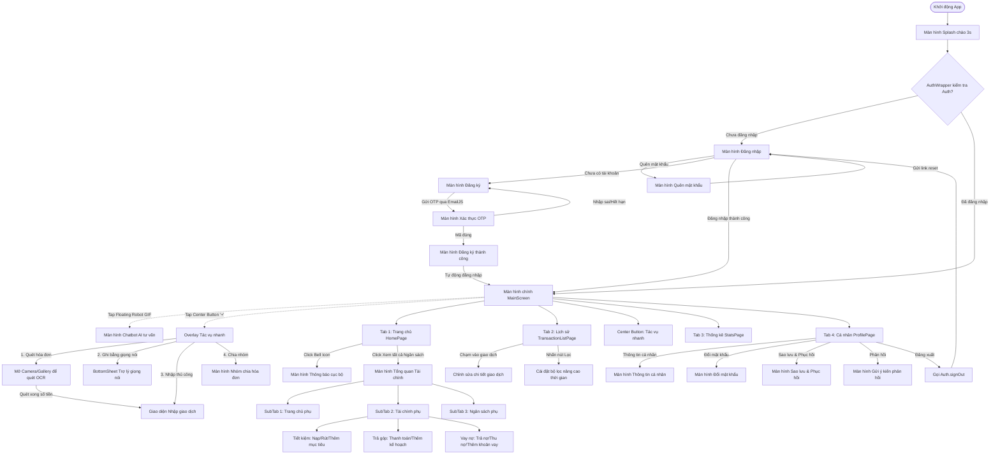

# Kế hoạch và Nội dung Báo cáo: Sơ đồ Điều hướng Ứng dụng (Navigation Flow)

Tài liệu này bao gồm hai phần chính:
1. **Hướng dẫn các điểm cần chụp ảnh màn hình (Screenshots)** để minh họa luồng điều hướng trong báo cáo.
2. **Nội dung báo cáo chi tiết (Bản tiếng Việt)** có sẵn sơ đồ luồng Mermaid và mã nguồn minh họa cách thức cài đặt điều hướng để bạn copy trực tiếp vào báo cáo/kế hoạch của mình.

---

## PHẦN I: HƯỚNG DẪN CÁC ĐIỂM CẦN CHỤP ẢNH MINH HỌA

Để báo cáo sinh động, bạn nên chụp ảnh các màn hình theo đúng trình tự luồng di chuyển của người dùng dưới đây:

### 1. Luồng Khởi Động & Xác Thực (Splash & Auth Flow)
*   **Màn hình Splash (Splash Screen):** Chụp màn hình chào với hiệu ứng logo và tên ứng dụng khi vừa mở.
*   **Màn hình Đăng nhập (Login Screen):** Chụp form đăng nhập, nút Đăng nhập bên thứ 3 và các liên kết "Đăng ký", "Quên mật khẩu".
*   **Màn hình Đăng ký & Xác thực OTP:** 
    *   Chụp form nhập thông tin đăng ký tài khoản mới.
    *   Chụp màn hình nhập mã OTP 6 số cùng bộ đếm ngược thời gian.
*   **Màn hình Quên mật khẩu (Forgot Password Screen):** Chụp giao diện nhập email để nhận liên kết khôi phục.

### 2. Màn hình Chính & Menu Tác Vụ Nhanh (Main Screen & Overlay)
*   **Màn hình chính (Main Screen - Home Tab):** Giao diện chính sau khi đăng nhập thành công.
*   **Menu Tác vụ nhanh (Quick Actions Overlay):** Chụp trạng thái khi nhấn vào nút **"+"** lớn ở giữa Bottom Nav: Nút xoay chéo thành hình chữ "x", nền mờ đi (Dim background) và hiển thị 4 nút chức năng nổi lên: "Quét hóa đơn", "Ghi âm giọng nói", "Nhập thủ công", "Chia nhóm".
*   **Chatbot trợ lý AI:** Chụp bóng nổi (floating action bubble) robot GIF ở góc màn hình và giao diện chat AI (`ChatbotScreen`) khi nhấn vào robot.

### 3. Điều Hướng Sâu Trong Các Tab (Deep Navigation inside Tabs)
*   **Tab Trang chủ → Màn hình Tổng quan lớn:** Nhấn chọn "Xem tất cả" tại phần Ngân sách để mở màn hình điều hướng tab lồng `AllOverviewScreen` (bao gồm tab Trang chủ phụ, Tài chính - Savings/Installment/Debt, Ngân sách).
*   **Tab Lịch sử giao dịch → Màn hình Lọc/Sửa:**
    *   Chụp giao diện bộ lọc nâng cao chọn ngày, ví, danh mục.
    *   Chụp màn hình chỉnh sửa chi tiết giao dịch khi chạm vào một mục lịch sử.
*   **Tab Cá nhân (Settings) → Các màn hình con:** Nhấp vào từng mục để chụp:
    *   Màn hình Thông tin cá nhân (`UserInfoScreen`).
    *   Màn hình Đổi mật khẩu (`ChangePasswordScreen`).
    *   Màn hình Sao lưu & Phục hồi dữ liệu (`BackupRestoreScreen`).
    *   Màn hình Gửi ý kiến phản hồi (`AppFeedbackScreen`).

---

## PHẦN II: NỘI DUNG BÁO CÁO CHI TIẾT (COPY LÀM PLAN/BÁO CÁO)

---

### **3.4. Thiết kế giao diện người dùng**

#### **3.4.1. Sơ đồ điều hướng (Navigation Flow)**

Để mang lại trải nghiệm người dùng liền mạch và chuyên nghiệp, kiến trúc điều hướng của ứng dụng được xây dựng theo mô hình **Điều hướng Độc lập Từng Tab (Nested Navigation)** kết hợp kiểm tra trạng thái xác thực tập trung ở ngoài cùng. 

Quy trình hoạt động được quản lý bởi `AuthWrapper`: lắng nghe trạng thái đăng nhập từ Firebase. Khi ứng dụng khởi động hoặc thay đổi trạng thái xác thực, hệ thống sẽ tự động chuyển đổi giao diện bằng hiệu ứng mờ dần (Fade Transition) mà không làm gián đoạn trải nghiệm người dùng. Bên trong màn hình chính, mỗi tab của thanh điều hướng dưới cùng (Bottom Navigation Bar) sở hữu một ngăn xếp điều hướng (`Navigator` với `GlobalKey`) riêng biệt. Điều này giúp người dùng có thể điều hướng sâu vào các màn hình chức năng ở Tab này (ví dụ: đang sửa giao dịch ở Tab Lịch sử) mà vẫn có thể chuyển sang Tab khác mà không bị mất trạng thái làm việc hiện tại.

##### **A. Sơ đồ điều hướng tổng thể ứng dụng**

Dưới đây là sơ đồ chi tiết luồng di chuyển giữa các màn hình trong ứng dụng:



##### **B. Mô tả chi tiết luồng di chuyển**

1.  **Giai đoạn Khởi động & Xác thực (Bootstrapping & Authentication):**
    *   Khi mở ứng dụng, màn hình `SplashScreen` hiển thị logo chào trong vòng 3 giây để đồng bộ hóa và tải dữ liệu ban đầu.
    *   `AuthWrapper` xác định trạng thái phiên làm việc:
        *   Nếu phiên đăng nhập hợp lệ (Firebase User khác null), điều hướng thẳng tới `MainScreen`.
        *   Nếu chưa đăng nhập, chuyển đến `LoginPage`. Từ đây, người dùng có thể đi tới `RegisterPage` để đăng ký (sau đó xác thực mã qua `OtpScreen` rồi mới được chuyển đến trang chủ) hoặc đi tới `ForgotPasswordScreen` để khôi phục mật khẩu qua Email.
2.  **Giai đoạn hoạt động tại Màn hình chính (`MainScreen`):**
    *   Màn hình chính sử dụng Bottom Navigation để phân chia không gian làm việc thành 4 Tab chính độc lập.
    *   **Nút trung tâm (Nút thêm nhanh "+"):** Khi được nhấn, nút này không chuyển trang mà mở ra một menu dạng lớp phủ (Overlay) nổi phía trên Bottom Bar, làm mờ màn hình bên dưới. Menu này cung cấp 4 lối tắt dẫn đến các tính năng đặc thù: Quét hóa đơn bằng camera (nhận diện tiền bằng OCR rồi chuyển tiếp sang màn hình nhập), kích hoạt bộ nhận diện giọng nói bằng Bottom Sheet, mở nhanh form nhập giao dịch thủ công, hoặc mở màn hình chia hóa đơn nhóm.
    *   **Robot Trợ lý ảo:** Một GIF robot nhỏ trôi nổi tự do trên màn hình (người dùng có thể kéo thả di chuyển vị trí). Chạm vào robot này sẽ mở màn hình Chatbot để trò chuyện với Gemini AI.
3.  **Điều hướng sâu bên trong các phân hệ (Deep-level Nested Navigation):**
    *   **Tại Tab 1 (Trang chủ):** Nhấn biểu tượng chuông trên Header dẫn tới màn hình danh sách Thông báo. Nhấn nút "Xem tất cả" tại phần Ngân sách sẽ dẫn sang màn hình tổng hợp lớn `AllOverviewScreen`. Màn hình này chứa 3 Tab phụ điều khiển bằng cử chỉ vuốt để quản lý chuyên sâu: Trang chủ phụ, Phân hệ Tài chính (gồm 3 Tab con nhỏ hơn: Tiết kiệm, Trả góp, Vay nợ), và Phân hệ Ngân sách.
    *   **Tại Tab 2 (Lịch sử):** Người dùng có thể nhấn lọc nâng cao (mở màn hình chọn khoảng thời gian) hoặc chạm vào từng dòng giao dịch để mở màn hình chỉnh sửa chi tiết giao dịch đó.
    *   **Tại Tab 4 (Cá nhân):** Cung cấp danh sách các tùy chọn. Nhấp vào mỗi dòng sẽ mở ra một màn hình riêng biệt tương ứng như cập nhật thông tin profile, đổi mật khẩu bảo mật, tiến hành sao lưu thủ công lên Firestore hoặc gửi phản hồi góp ý lỗi về hệ thống. Khi nhấn Đăng xuất, luồng xác thực bị hủy, đưa người dùng trở lại màn hình `LoginPage`.

---

##### **C. Đoạn code cài đặt điều hướng tiêu biểu**

###### **1. Quản lý trạng thái khởi chạy và xác thực tập trung (`lib/main.dart`)**
Ứng dụng sử dụng `AnimatedSwitcher` kết hợp lắng nghe trạng thái xác thực trong `AuthWrapper` để chuyển đổi qua lại giữa Splash, Login và MainScreen một cách mượt mà.

```dart
// File: lib/main.dart (Trích đoạn AuthWrapper)
class AuthWrapper extends StatefulWidget {
  const AuthWrapper({super.key});

  @override
  State<AuthWrapper> createState() => _AuthWrapperState();
}

class _AuthWrapperState extends State<AuthWrapper> {
  bool _showSplash = true;

  @override
  void initState() {
    super.initState();
    // Đếm ngược 3 giây hiển thị Splash Screen chào người dùng
    Future.delayed(const Duration(seconds: 3), () {
      if (mounted) {
        setState(() => _showSplash = false);
      }
    });
  }

  @override
  Widget build(BuildContext context) {
    final authProvider = Provider.of<AuthProvider>(context);

    // Quyết định màn hình hoạt động dựa trên trạng thái xác thực
    Widget activeWidget;
    if (_showSplash || authProvider.isLoading) {
      activeWidget = const SplashScreen(key: ValueKey('splash'));
    } else if (authProvider.isAuthenticated) {
      activeWidget = const MainScreen(key: ValueKey('main'));
    } else {
      activeWidget = const LoginPage(key: ValueKey('login'));
    }

    // Tạo hiệu ứng FadeTransition khi chuyển trang
    return AnimatedSwitcher(
      duration: const Duration(milliseconds: 600),
      switchInCurve: Curves.easeIn,
      switchOutCurve: Curves.easeOut,
      transitionBuilder: (Widget child, Animation<double> animation) {
        return FadeTransition(opacity: animation, child: child);
      },
      child: activeWidget,
    );
  }
}
```

###### **2. Cơ chế điều hướng lồng độc lập từng Tab (`lib/ui/home/main_screen.dart`)**
Mỗi tab có một `Navigator` riêng biệt giúp giữ nguyên trạng thái trang con khi người dùng chuyển đổi qua lại giữa các tab trên Bottom Navigation Bar.

```dart
// File: lib/ui/home/main_screen.dart (Trích đoạn TabNavigator)
class TabNavigator extends StatelessWidget {
  final GlobalKey<NavigatorState> navigatorKey;
  final Widget rootPage;
  final NavigatorObserver? navigatorObserver;

  const TabNavigator({
    super.key,
    required this.navigatorKey,
    required this.rootPage,
    this.navigatorObserver,
  });

  @override
  Widget build(BuildContext context) {
    return Navigator(
      key: navigatorKey,
      observers: navigatorObserver == null
          ? const <NavigatorObserver>[]
          : <NavigatorObserver>[navigatorObserver!],
      onGenerateRoute: (routeSettings) {
        // Trả về trang gốc tương ứng của Tab khi khởi tạo ngăn xếp
        return MaterialPageRoute(builder: (context) => rootPage);
      },
    );
  }
}
```

###### **3. Lắng nghe thay đổi Route để ẩn/hiện Bottom Nav Bar (`lib/ui/home/main_screen.dart`)**
Lớp `_TabRouteObserver` giúp bắt sự kiện chuyển trang để ẩn Bottom Navigation Bar khi đẩy một màn hình con lên trước, tránh việc đè giao diện.

```dart
// File: lib/ui/home/main_screen.dart (Trích đoạn Route Observer)
class _TabRouteObserver extends NavigatorObserver {
  _TabRouteObserver({required this.onChanged});
  final VoidCallback onChanged;

  void _notifyChanged() => onChanged();

  @override
  void didPush(Route<dynamic> route, Route<dynamic>? previousRoute) {
    super.didPush(route, previousRoute);
    _notifyChanged();
  }

  @override
  void didPop(Route<dynamic> route, Route<dynamic>? previousRoute) {
    super.didPop(route, previousRoute);
    _notifyChanged();
  }
}

// Logic kiểm tra và cập nhật trạng thái NavBar trong MainScreenState:
void _updateNestedRouteState() {
  if (!mounted) return;
  WidgetsBinding.instance.addPostFrameCallback((_) {
    if (!mounted) return;

    final currentNav = _navigatorKeys[_selectedIndex].currentState;
    // Kiểm tra xem navigator hiện tại của Tab có trang con nào đang được đẩy lên không (canPop = true)
    final bool shouldHide = currentNav?.canPop() ?? false;

    if (!shouldHide && !_isNavBarVisible) {
      setState(() => _isNavBarVisible = true);
    }

    if (_isNestedRouteActive == shouldHide) return;
    setState(() => _isNestedRouteActive = shouldHide);
  });
}
```
